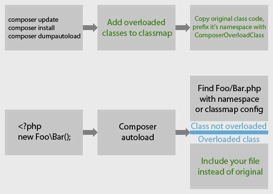

[](https://github.com/steevanb/composer-overload-class/tree/1.1.3)
[](https://getcomposer.org)


[](https://insight.sensiolabs.com/projects/a753e540-2863-444f-a174-d743ca475566/analyses/8)
[](https://scrutinizer-ci.com/g/steevanb/composer-overload-class/)

composer-overload-class
-----------------------
Allow to overload autoloaded classes, to include your files instead of supposed ones.

Sometimes, you need to overload a class from a dependency. But you can't, cause you've found a nice "new Foo\Bar()" somewhere in this dependency...

So, if your project use Composer autoload (like Symfony projects for example), you can use steevanb/composer-overload-class.

With a simple configuration, you can specify to Composer in which file it will find a class (your file), instead of let him find original file with class namespace.
Cause you can't change namespace and class name of original class, otherwise all dependencies to this namespace / class name will fail
(use Foo\Bar, method parameter type, etc), composer-overload-class will clone Foo\Bar class content into ComposerOverloadClass\Foo namespace.

Your class need to have exact same namespace as overloaded one, and you can extends ComposerOverloadClass\Foo\Bar if you need.



[Changelog](changelog.md)

Installation
------------

```bash
composer require steevanb/composer-overload-class ^1.1
```

Configuration
-------------

To overload a class, you need to configure it via your composer.json.

Example taken from [steevanb/doctrine-stats](https://github.com/steevanb/doctrine-stats), to overload Doctrine ObjectHydrator :
```json
# composer.json
{
    "scripts": {
        "__comment": "Add a script who generate cloned classes, when autoload is generated",
        "pre-autoload-dump": "steevanb\\ComposerOverloadClass\\OverloadClass::overload"
    },
    "extra": {
        "__comment": "Path to a writable directory, where overloaded classes will be cloned, with it's namespace prefixed by ComposerOverloadClass, in prod + dev env",
        "composer-overload-cache-dir": "var/cache/prod",
        "__comment": "Path to a writable directory, in dev env",
        "composer-overload-cache-dir-dev": "var/cache/dev",
        "__comment": "Classes to overload, in prod + dev env",
        "composer-overload-class": {
            "__comment": "Fully qualified class name you want to overload",
            "Doctrine\\ORM\\Internal\\Hydration\\ObjectHydrator": {
                "__comment": "Path to original file, who contains the class you want to overload",
                "original-file": "vendor/doctrine/orm/lib/Doctrine/ORM/Internal/Hydration/ObjectHydrator.php",
                "__comment": "Path to your file, who contains your class",
                "overload-file": "vendor/steevanb/doctrine-stats/ComposerOverloadClass/Doctrine/ORM/Internal/ObjectHydrator.php"
            }
        },
        "__comment": "Classes to overload, in dev env",
        "composer-overload-class-dev": {}
    }
}
```

When configuration is finished, you need to re-generate Composer autoload :
```bash
composer dumpautoload
composer dumpautoload -v
```

That's all folks !

Example with Doctrine ObjectHydrator
------------------------------------

Example taken from steevanb/doctrine-stats, to overload Doctrine ObjectHydrator, to add a timer when entities are hydrated :

```php
# src/ComposerOverloadClass/Doctrine/ORM/Internal/ObjectHydrator.php
<?php

namespace Doctrine\ORM\Internal\Hydration;

use Doctrine\ORM\EntityManagerInterface;
use steevanb\DoctrineStats\Doctrine\ORM\Event\HydrationEventsTrait;

# extends cloned ObjectHydrator class, i just want to change hydrateAllData() code
class ObjectHydrator extends \ComposerOverloadClass\Doctrine\ORM\Internal\Hydration\ObjectHydrator
{
    use HydrationEventsTrait;

    /**
     * @return EntityManagerInterface
     */
    protected function getEntityManager()
    {
        return $this->_em;
    }

    protected function hydrateAllData()
    {
        $eventId = $this->dispatchPreHydrationEvent();
        parent::hydrateAllData();
        $this->dispatchPostHydrationEvent($eventId);
    }
}
```
